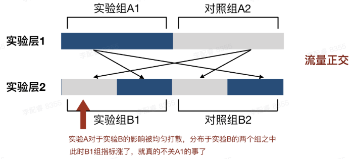

本次分享的目的：

* 了解 A/B 测试的一些基本概念
* 一些简单的代码分流实现

### 为什么需要 A/B 测试

* 需要一种靠谱的评估方法来判断目标的有效性

  个人经验判断带来的不一致性和主观性

* 找到数据变动的真实因素

  找到那个真正影响数据的因素

  

### 什么是 A/B 测试

A/B 测试是一种随机实验过程，通过将**一种**变量的**多个**版本**同时**展示给不同的用户，来确定哪个版本能带来最大程度的业务指标提升。


根据以上的描述，来总结 A/B 测试的三个特点：


* ###### 一个 A/B 测试只有一个变量

* 一个 A/B 测试可以多个版本同时进行，并不局限于两种方案

* A/B 测试的多种方案需要同时进行，具有相同的实验环境


### A/B 测试的应用场景


* 精细化运营，数据驱动业务增长
* 为功能调整提供低风险，可量化的统计方法


### A/B 测试的一些概念


#### 命中

用户参与到实验之中即为命中，反之则为 “未命中”


#### 实验组，对照组

实验组和对照组是一组相对的概念，A/B 测试通常是为了验证一个新策略的效果，在实验中，抽取的用户随机分配到 A 组 和 B 组中，A 组用户体验到新策略，B 组用户体验到旧策略，那么 A 为实验组， B 为对照组。


#### 实验

我们将一个 A/B 测试称为一个实验，注意要和实验组不是一个东西，

实验组是一个实验内划分的，一个实验里面区分多个实验组和对照组。


#### 互斥实验

不能共享流量的两种实验

* 一份流量，实验顺序进行
* 流量拆分，同时进行多个实验，实验之间的流量互相独立


#### 实验层技术

如果有多个 A/B 测试需要进行，进行时会出现一些问题：

* 如果将流量平均分配到多个实验中，当实验过多或总流量减少时，单个实验分配的流量就会减少，较少的流量会增大数据的误差
* 一个个的进行实验会浪费时间，造成实验效率低下


解决方式：

将每一个独立实验分为一个实验层，流量经过每一个实验层之后，再进行一个科学分配


#### 正交实验

采用实验层技术的一种实验方式，提高实验效率的同时保证科学分配：




举例，我们要同时做位置和颜色的实验，使用正交实验过程如下：

```text
总流量：100%

位置实验（实验层1）： 位置上（实验组A1） 位置下 (对照组A2)

颜色实验（实验层2）： 颜色黑（实验组B1） 颜色白（对照组B2）


上（50%）下（50%）

黑（50%）白（50%）

经过流量正交之后，分为四个版本：

黑上，黑下，白上，白下（25%）

统计数据，统计位置变化对于数据的影响，可以分别对比下面两组的数据：
黑上 + 白上   黑下 + 白下

因为颜色变化在两个组里面的分配比例一致，颜色变化对于实验的影响均匀分配到两个组中，所以不必担心颜色实验的影响
```


### 如何设计一个 A/B 测试


* 分析现有流程找到存在问题的环节

  

* 观察分析用户行为，找到造成问题的原因

  

* 构建假设，尝试新增解决方案

  

* 验证假设，通过 A/B 测试来对多种方案进行评估

  

* 分析数据，采用方案

  

### 需要注意的一些问题

当 A/B 测试被设计出来之后，针对产品提出的具体实验过程，实验中的一些问题需要我们进行合理质疑的：


####  A/B 测试只做两种方案，非 A 即 B

注意： A/B 测试是多方案同时进行的，不存在非对即错的思想，一个产品的改动会有各种各样的争议，我们需要列举出多种，足够多的假设来进行一一尝试，A/B 测试是一个多方案择优实验的过程，不是判断对错的过程


#### A/B 测试没有对照组

不能拿新功能的数据来直接对比线上的数据，新旧功能上线的时间周期不同，宣发强度不同，或者可能受其他功能的影响，直接对比的方式得出的结论并不客观。


#### 一个A/B 测试有多个变量

多个变量带来的影响无法确定是哪个变量产生的积极或者消极作用，如果需要同时实验多个变量，需要将其分为一个个的实验，使用实验层技术进行正交实验来寻求最优解。


#### 无法保证数据的随机性

流量分配的方法要保证其尽可能的随机，比如，用用户标识的奇偶来进行分配，如果不能保证生成标识的算法是否足够随机，那流量分配可能会有偏好

#### 

### A/B 测试的代码实现


#### 随机算法的设计

相关文章：

https://towardsdatascience.com/assign-experiment-variants-at-scale-in-a-b-tests-e80fedb2779d

好的随机算法的原则：

* 对于一个实验，用户看到一个实验的不同分组的过程不能有偏向性

* 对于同一个用户，重复实验得到的结果应该是确定的

* 同时运行多个实验，多个实验之间不能相互影响关联的情况，用户看到下一个实验的概率不能受到上一个实验的影响

* 随机算法应该是支持增加用户看到实验组的概率，在不改变原来实验组人员的情况下，调节增加更多的实验组成员

  > 短期的活动页面，需要支持更加灵活的流量分配


#### nginx 分流

##### 目前公司方案：

```nginx
localtion / {
  # 匹配 xkw-device-id 符合后面的正则
	#if ($cookie_xkw-device-id ~* "[A-F0-9]{31}([A-B]|[0-3])") {
  #    proxy_pass http://newM2feature;
  #}
  proxy_pass http://newM2master;
}
```

存在的问题：1、无法保证生成 `xkw_device_id` 的算法的随机性，2、比例分配不灵活


##### split_clients

ngx_http_split_clients_module  是默认集成到 nginx 中的，不需要额外的安装成本

文档地址：

https://nginx.org/en/docs/http/ngx_http_split_clients_module.html#example

Demo

```nginx
http {
  map $http_cookie $xkw_device_id {
    "~*xkw-device-id=([^;]+)" $1;
  }

  split_clients $xkw_device_id $variant {
    50% "a";
    50% "b";
  }

  server {
    listen 8081;
    server_name localhost;
    root /Users/zhangningning/Desktop/个人文件/文章/A:Btest/nginx;
    set $use_file "A.html";
    location / {

      if ($variant = "a") {
        set $use_file "A.html";
      }
      if ($variant = "b") {
        set $use_file "B.html";
      }

      index $use_file;
    }
  }
}
```

关于ngx_http_split_clients_module 使用 MurmurHash2 算法的说明：

https://stackoverflow.com/questions/11899616/murmurhash-what-is-it/


##### nginx lua

通过可编程的方式实现流量分配

```
# http {
#     lua_package_path "/path/to/lua-scripts/?.lua;;";
#     lua_package_cpath "/path/to/lua-scripts/?.so;;";
#     ...
# }


# function ab_test()
#     local random = math.random(100)
#     if random <= 50 then
#         return "A"
#     else
#         return "B"
#     end
# end

# local variant = ab_test()
# ngx.var.ab_variant = variant


# server {
#     ...
#     location / {
#         access_by_lua_file /path/to/lua-scripts/ab_test.lua;
#         if ($ab_variant = "A") {
#             proxy_pass http://backend_a;
#         }
#         if ($ab_variant = "B") {
#             proxy_pass http://backend_b;
#         }
#         ...
#     }
# }
```

https://github.com/openresty/lua-nginx-module#installation


#### 前端应用

* 代码层面逻辑控制

  * 灵活，精细，容易调整
  * 需要接口实现
  * 维护问题导致的无用代码

  

* 分支拆分

  * 方便，省心
  * 粗粒度，不灵活 
  * 带来的分支维护成本以及合并问题


#### 数据统计

测试的结果是否采用需要使用数学的统计方法来判定，个人经验得出的结论存在误差，缺少说服力。

更多统计可看下面的文档：

https://zhuanlan.zhihu.com/p/346602966


#### 业界实现

火山引擎A/B测试方案的实现过程：

https://console.volcengine.com/datatester


#### 没有银弹

* 数据的随机波动和时间影响导致结果的不可信。

  科学的统计方法才能得到正确的结论。

* 要采用哪种方案，要综合多种因素，不是数据唯一决定的。

  A/B 测试的方案还需要结合业务的定位，宣传方向等一起决定。


#### 参考文档

[聊聊数据驱动和用A/B测试解决问题](https://developer.volcengine.com/articles/7036766927343075341)

https://www.modb.pro/db/632761


### 