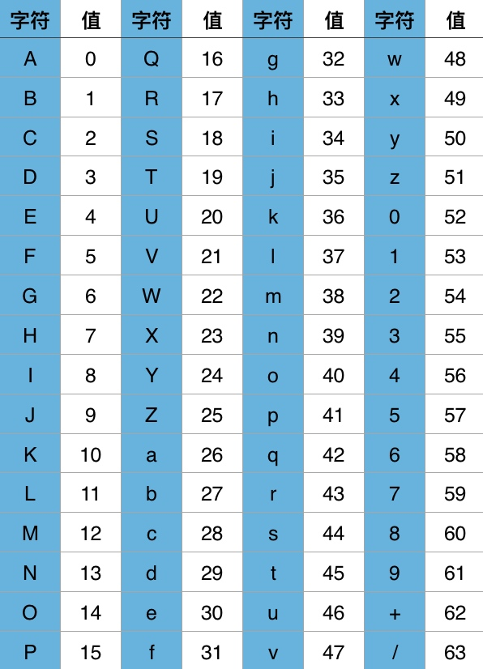

base64 作为一种编码方式， 可以将对于一些数据使用base64 编码， 那么， 为什么使用 base64 编码， 使用 base64 编码的原理是什么以及 base64 编码在前端的应用，下面的文章将会涉及这些内容：

## what is base64?

在计算机中， 一个字节通常有8位字符， 这些字符使用二进制表示共有 256 种组合， 这些组合形成了 ascii（American Standard Code for Information Interchange，美国信息交换标准代码） 码：一种字节组合和字符的对应表,  基础的 ascii 码共有 128 种组合， 因为不同国家语言字符的需要， 现在很多是扩展的 ascii码，但不同的 扩展ascii 码的前 127 位是基本相同的， 这一部分称为基础 ascii 码： 

 

假如我们不通过 base64 编码， 而是直接向不同设备传输二进制数据，因为一些老旧设备或者软件对于某些二进制值字符的处理方式可能不同， 因就有可能被错误处理，为了解决这种问题， 我们使用base64 编码将数据统一编码为可见字符，而可见字符在大多设备上的表现行为是一致的，这样就使得数据在不同设备之间的处理出错的可能被降低了。

Base64 码共用 64 种对应字符， 对应字符如下:

## base64编码原理

base64 本质上是将二进制数据转为文本的形式， 当遇到十进制数据的时候， 需要将十进制转为二进制， 对于二进制数据以联系 6 比特计算其十进制值， 在根据这个值查找上图 base64表中的字符， 最终我们得到的这段文本即是我们编码后的数据;