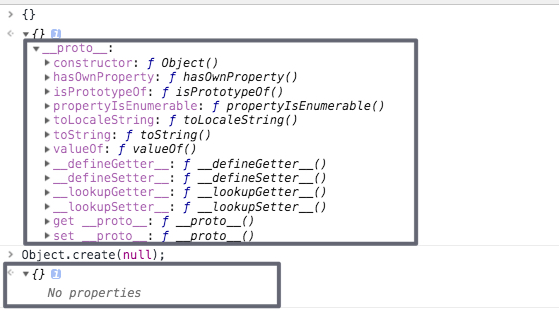

#### utils 函数

***

在 vue 的 utils.js  文件中提供了一些使用的公共方法， 下面是在阅读这部分代码的时候的一些笔记：

##### 判断值的类型

```js
// 使用 Object.toString 得到的是 [object type]
// 可以获取到 type 值来获取到要进行判断的类型
const _toString = Object.prototype.toString
function toRowType = value => _toString.call(value).slice(8, -1)
```

如下： 判断值为纯对象：

```js
function isPlainObject = obj => toRowType(obj) === '[object Object]';
```

判断为正则

```js
function isRegExp = val => toRowType(val) === '[object RegExp]';
```

##### 判断一个值为 `promise`

```js
function isPromise(val) {
  return val !== undefind && 
  			 val !== null && 
  			 typeof val.then === 'function' && 
  			 typeof val.catch === 'function'
}
```

也可以使用 `instanceof` 方法进行判断：

```js
function isPromise(val) {
  return val instanceof Promise;
}
```

上面的那种方法更多的是为了一些浏览器不能兼容 promise 的原因

##### 通过函数的方法判断字符串中是否含有字符串

```js
function makeMap(str) {
  // 使用 Object.create 用来创建一个 “干净”的对象
  const map = Object.create(null);
  const list = str.split(',');
  for (let i = 0; i < list.length; i ++) {
    map[list[i]] = true
  }
  return val => map[val];
}
```

在 vue 中，使用上面的方法用来判断一串使用逗号分割的字符串中是否包含有某个字符串：

目前， 使用 es6 的 `includes` 可以实现这种效果。

上面的 `Object.create` 方法， 可以创建自继承自传入值的对象， 例如上面的 `Object.create(null)` 代码就是创建了一个空对象， 与 `{}` 对象不同的是， 通过 `create` 创建的空对象， 没有继承 `Object.prototype` 上面的方法。

例如：



在上面中 使用 `create` 创建的空对象， 原型上面没有任何的属性

使用 `Object.create` 创建空对象的好处如下：

+ 创建的对象比较“干净”,  我们可以实现自定义的比如 `toString` 方法
+ 使用 `for in` 的时候无需使用 `hasOwnProperty` 方法判断属性是不是继承的来的属性， 并且必用遍历继承的属性而提高了性能。

##### 校验相等， 对于对象， 判断是否 “看起来” 一样：

在代码中使用 `looseEqual`  这个函数， 如下：

```js
/**
 * Check if two values are loosely equal - that is,
 * if they are plain objects, do they have the same shape?
*/
export function looseEqual (a, b){
  if (a === b) return true
  const isObjectA = isObject(a)
  const isObjectB = isObject(b)
  // 当都为对象的时候
  if (isObjectA && isObjectB) {
    try {
      const isArrayA = Array.isArray(a)
      const isArrayB = Array.isArray(b)
      // 当都为数组的时候
      // 这里判断数组相等， 可以先判断数组长度是否相等
      if (isArrayA && isArrayB) {
        return a.length === b.length && a.every((e, i) => {
          return looseEqual(e, b[i])
        })
        // 对于时间判断的时候， 通过 getTime() 来判断
      } else if (a instanceof Date && b instanceof Date) {
        return a.getTime() === b.getTime()
      } else if (!isArrayA && !isArrayB) {
        const keysA = Object.keys(a)
        const keysB = Object.keys(b)
        // 判断都为对象的时候
        return keysA.length === keysB.length && keysA.every(key => {
          return looseEqual(a[key], b[key])
        })
      } else {
        /* istanbul ignore next */
        return false
      }
    } catch (e) {
      /* istanbul ignore next */
      return false
    }
  } else if (!isObjectA && !isObjectB) {
    return String(a) === String(b)
  } else {
    return false
  }
}
```

##### once 函数方法

```js
// 确保 fn 只会调用一次
function once(fn) {
  let called = false;
  return function () {
    if (!called) {
      called = true;
      fn.apply(this, arguments);
    }
  }
}
```

##### 正则相关

代码中， 使用正则中的 `replace` 方法实现了对于变量命名由驼峰式转变为为连字符式：

```js
function hyhenate(str) {
  return str.replace(/\B([A-Z])/g, '-$1').toLowerCase()
}
hyhenate('myComponent'); // my-component
```

相关 `replace` 的一些特性， 在博客文章  [正则表达式（二）：基础方法](<https://newpromise.github.io/2019/01/20/%E6%AD%A3%E5%88%99%E8%A1%A8%E8%BE%BE%E5%BC%8F%EF%BC%88%E4%BA%8C%EF%BC%89%EF%BC%9A%E5%9F%BA%E7%A1%80%E6%96%B9%E6%B3%95/>) 中已经说明， 需要注意的一些地方：

+ 正则表达式中需要添加标识符 `g` 用来进行全局匹配捕获
+ 正则中使用括号包裹的表示一个捕获组进行捕获到的数据
+ 使用 `\B` 表示匹配单词内部

使用正则将连字符单词转换为驼峰式的单词：

```js
function camelize(str) {
  return str.replace(/-(\w)/g, (_, c) => c ? c.toUpperCase() : '')
}
camelize('my-component'); // myComponent
```

注意： 关于 `replace` 的第二个参数,  可以阅读  [正则表达式（二）：基础方法](<https://newpromise.github.io/2019/01/20/%E6%AD%A3%E5%88%99%E8%A1%A8%E8%BE%BE%E5%BC%8F%EF%BC%88%E4%BA%8C%EF%BC%89%EF%BC%9A%E5%9F%BA%E7%A1%80%E6%96%B9%E6%B3%95/>)   中关于<a href="/2019/01/20/正则表达式（二）：基础方法/#replaceFn">replace</a>的相关知识。

