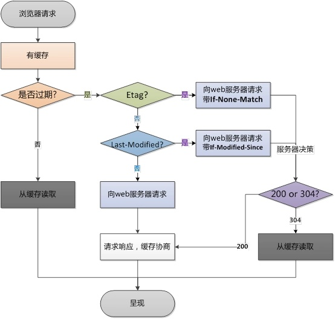

缓存是指代理服务器或者客户端本地磁盘内保存的资源副本。使用缓存可以减少对于源服务器的访问，从而节省通信流量和通信时间。

在服务器与客户端的通信过程中，对于数据的缓存方式可以分为 **强缓存** 和 **协商缓存** 两种，通过http请求头中的 `Cache-Control` 可以决定是否采用上面两种方式

缓存涉及到的相关字段有：

`Cache-Control`  `Expires`  `Last-Modified` `If-Modified-Since` `Etag`  `If-None-Match`

### 强缓存

强缓存就是当客户端发起请求之前，首先检查浏览器缓存中是否有要请求的内容，并且根据结果的缓存规则来判断是否实际向服务器发起请求

客户端发起请求时，会有下面三种结果：

1. 没有缓存结果，那么需要向服务器请求内容
2. 存在缓存结果，并且缓存规则未失效，那么直接使用缓存的内容
3. 存在缓存结果，但缓存规则已经失效，那么也需要重新向服务器请求内容，效果同 1

使用请求返回头中的：`Cache-Control` 字段来配置缓存的行为：

- `public`:  可以向任意方提供响应的缓存，发送请求的客户端或者代理服务器都可以缓存数据

- `private`: 只有浏览器才能缓存内容

- `no-cache`: 强制所有缓存了该响应的用户，在使用已经缓存的数据前，发送带有验证的请求到服务器，需要等待服务器确认之后，才能使用浏览器缓存

- `no-store`: 不进行缓存，每次请求都需要向服务器重新请求数据

- `max-age`: 指定资源的缓存时间，

  在客户端请求头中添加时，表示如果缓存资源的缓存时间数值比设置的 `max-age` 的数值小的话，那么客户端就接收缓存的资源

  当服务器响应头中添加时，表示当前返回的资源内容在浏览器中的最大缓存时间，在没有禁用缓存并且没有超过有效时间的情况下，再次访问这个资源就命中了缓存，不会向服务器请求资源而是直接从浏览器缓存中取。

### 协商缓存

协商缓存就是当强制缓存失效后，客户端和服务器根据请求头或者响应头的相关字段来判断是否采用浏览器缓存的资源，因为有可能客户端请求的资源过了有效期，但是此时资源内容和服务器上的资源没有差别，仍然可以使用浏览器缓存资源来避免再次请求服务器资源

协商缓存是由服务器来决定是否使用缓存的

因此关键是：**如何判断服务器上的资源和浏览器上缓存的资源是不是相同的**，下面的两种方式分别是根据文件修改时间和文件唯一标识来判断的，

两种方式：

- **Last-modified/If-Modified-Since**

  这两个字段是一种时间戳的形式字符串

  服务器响应头中带有： Last-modified 表示资源最后被修改的时间，当客户端再次请求相同资源时，在请求头中添加 `If-Modified-Since` 字段为上次请求资源时服务器返回的资源最后修改时间，服务器收到请求之后，会将 

  `If-Modified-Since` 的时间与  `Last-modified` 进行对比，如果不一致，则重新请求资源，如果一致，那么使用浏览器缓存的资源（304）

- **Etag/If-None-Match**

  这两个值都是请求当前资源文件的唯一标识，这个标识是由服务器生成的

  类似于上面的过程，`Etag` 由服务器返回，`If-None-Match` 是再次请求资源时添加在请求头中的字段，值是上次请求时返回头中返回的 `Etag` 字段的值，在服务器中，根据 `If-None-Match`的字段值与该资源在服务器的Etag值做对比，如果不一致，重新请求资源，如果一致，同样使用浏览器缓存资源（304）

> 在 http 中，状态码 304 （Not Modified）返回的内容为空，因为这个时候表示当前请求的资源和服务器上的资源一致，可以直接使用浏览器缓存的内容

### 总结

概括来说：

**强缓存**是直接使用浏览器内缓存的内容，使用到的字段有：**Expires** 或者 **Cache-Control: max-age=3600** (表示资源的缓存时间是 3600 s)

**协商缓存**是需要服务器参与确认是否使用浏览器缓存的内容的机制，应用在强缓存失效之后

这个过程可以用下面的示意图来说明：

