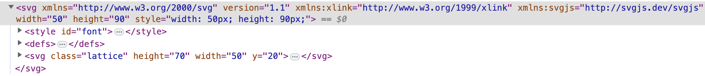
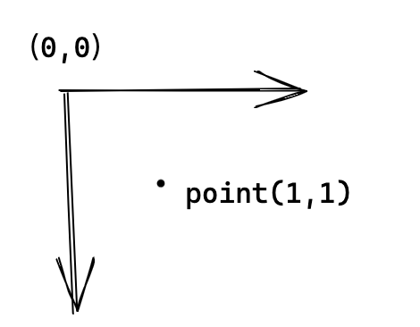
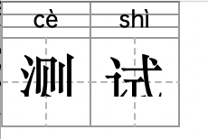

我将为您优化这个Markdown文档的结构，使其更清晰易读，同时保持所有原始内容不变。

```markdown
---
title: 拼音编辑器技术实现
date: 2025-04-11 11:45:47
tags: SVG, DOM, fontmin
categories: frontend, svg, fonts
---

# 拼音编辑器

拼音编辑器提供给教研老师一个编辑拼音，汉字，英文的平台，集成到 qbm，提高教研同事的工作效率。

体验地址：https://static.zxxk.com/qd/pinyin-editor/index.html

## 需求背景

实现一个拼音编辑器，提高教研同事工作效率

### 实现功能

1. 三种形式的内容编辑：
   - 组合格
   - 四线三格
   - 田字格
2. 组合格中的拼音支持切换音调，遵循拼音的注音逻辑
3. 多音字支持切换不同的拼音
4. 支持新增、删除、换行格子
5. 四线三格支持跟随内容的输入而宽度变化，自适应
6. 支持导出为 svg 形式的 base64
7. 支持修改编辑，编辑内容回显

## 技术实现

### 代码结构

#### Dom 结构



结构说明：

- **最外层`svg`**：编辑器内容区的容器，后面的子元素都是相对于这个 svg 进行定位的。
- **`style`**：用来放置一些样式，这里是用来放置字体，根据是四线三格还是组合格，分别引入不同的字体文件。
- **`defs`**：[defs](https://developer.mozilla.org/en-US/docs/Web/SVG/Element/defs) 用来放置一些公共的后面会用到的 svg 图形，理解为一个公共组件，这里两个组件：
  - `sxsg-lines`：定义四线三格的线段
  - `tzg-lines`：用来定义田字格的线段
  
  在后面使用的时候，通过使用 `use` 的方式引入：`<use href="#tzg-lines"></use>`

- **`svg.lattice`**：使用类名为 `lattice` 的 svg 为编辑器的格子，编辑器的内容区都是由一个个的这样的格子构成的，通过修改这些格子的 x, y 的属性，来调整位置，实现换行和新增格子的功能。

##### `svg.lattice` 详细结构

主要有两部分构成：
1. 背景线条的svg元素（红色区域）
2. 编辑内容区域（蓝色区域）


包含元素：
- `svg.frame-group`：组合格的内容区域，包含 `svg.frame-sxsg` 和 `svg.frame-tzg`
- `svg.frame-sxsg`：四线三格的内容区域
- `svg.frame-tzg`：田字格的内容区域边框
- `use`：引用前面 `defs` 元素中声明好的图形
- `foreignObject`：用来在 svg 元素中嵌入 html 内容

#### 代码逻辑结构

- `Editor`：编辑器，对于格子元素进行删除，添加，换行位置的控制，svg 内容的导出，编辑器初始化，接受修改的数据回显
- `Lattice`：编辑器格子，创建格子元素的结构，添加格子内的可编辑内容
- `EditText`：格子内容部分，处理编辑事件，对于输入的内容进行校验，添加一些dom事件
- `Frame`：用来绘制格子中的格子线，创建两种类型的格子线，四线三格和田字格的线段

大体结构图示（以田字格为例）：


> 另外存在一个 `Events` 类，`Lattice` 和 `EditText` 都有继承，用来方便进行事件通信

### 功能实现流程图

1. **拼音的输入，切换声调的实现**
   

2. **输入汉字获取拼音**
   [compositionend](https://developer.mozilla.org/en-US/docs/Web/API/Element/compositionend_event)
   

3. **换行，删除，新增格子的实现**
   都是在 `EditText` 中触发一些事件，向上传递至 `Editor`，在 `Editor` 中进行格子元素的控制

## 技术难点与解决方案

### 字体问题

#### 字体选择标准
- 汉字：楷体
- 英文：和人教版pep的字体保持一致（舒窈意大利斜体）
- 拼音：需要考虑到特殊字符（带音调的字母）的适配

> 四线三格中的字体为手写体，我们常见的英文字体可以称为印刷体，写在四线三格中的手写体和印刷体有写法上的不同，手写体有比较强的个人风格，可以类比为我们汉字字体中的楷书，行书，兰亭体，衡水体
> 
> 小学英语教材中的四线三格英文字体应该采用何种没有明确的规定，是由出版社来决定的

#### 拼音字体注意事项
1. 渲染问题（单层 a 和 双层 a）
   - 都可以，但大多使用单层 a，没有特殊要求
2. 选择的字体中需要对于特殊的声调进行处理
3. 选择开源免费可商用字体
4. 中文字体需要减少体积

#### 解决方案
选用了免费可商用的字体：`OPPOSans-M-2`，并且使用 `fontmin` 进行字体文件提取

相关工具：
- [fontmin](https://github.com/ecomfe/fontmin)
- http://ecomfe.github.io/fontmin/#app

### SVG 相关技术

#### SVG 绘制
使用 [svgjs](https://svgjs.dev/docs/3.0/) 来进行 svg 元素的操作控制绘制。

#### SVG 中的定位问题
`svg` 中的元素是通过属性`x`, `y` 相对于 `svg` 左上角的位置（原点）进行定位的：
- x：相对于原点右边的位置
- y：相对于原点下面的位置



**解决方案**：通过创建 `svg` 元素的方式新建一个坐标系，在这个坐标系下进行定位。这就是为什么元素 `.frame-sxsg`、`.frame-tzg`、`.lines` 是 `svg` 元素的原因。

#### SVG 画线技术
1. **给定坐标点画线**
   
   - 两个坐标点之间画一条线
   - 从这条线上线进行均分边距

2. **绘制带边框的矩形**
   
   - 实现 box-sizing: 'border-box' 的效果

#### SVG 样式和字体处理
1. 字体要转换为 `base64` 的格式，避免使用路径找不到的问题
2. svg 中涉及到的 style 样式要写在 svg 作用域下面，用于导出时的使用

### 兼容性问题

#### 问题描述
svg 中混合 `foreignObject` 在 safari 浏览器上会有展示问题：


具体表现为：
- 作用在 `foreignObject` 上的样式不起作用
- 使用电脑默认字体 `Kaiti`，有的电脑上可能没有安装这种字体

#### 解决方案（2023-05-12更新）
通过使用 `text-to-path` 的方式解决，将文字转为 `path` 元素：

1. 移除了 style 内部的 fontface 引用，将本来嵌入到 svg 内部的 font 提取到页面引入
2. 移除了 foreignObject 元素，用 path 进行替换
3. 选用较小的中文字体 方正简体楷体，只有 3.9 MB，方便快速引用下载


相关工具：
- [text-to-path](https://github.com/shrhdk/text-to-svg)
```