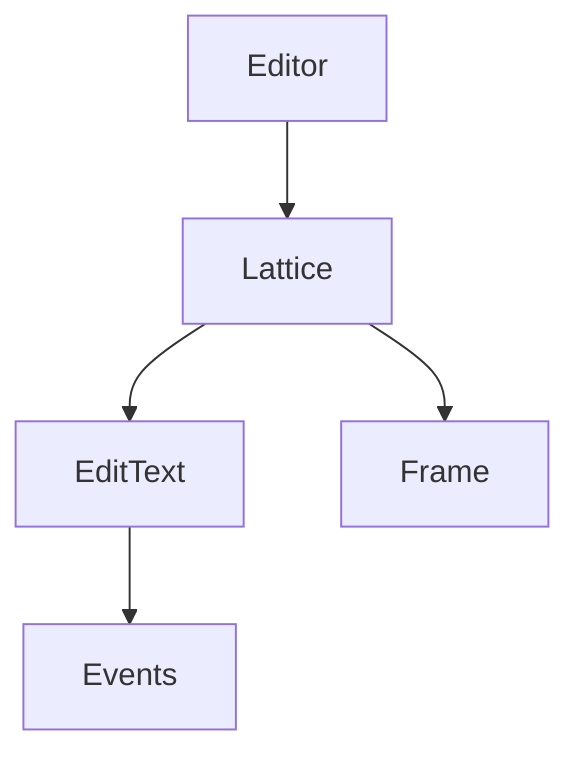

---
title: 拼音编辑器技术实现
date: 2025-04-11 13:50:15
tags: SVG, DOM, fontmin
categories: frontend, svg, fonts
---

# 拼音编辑器技术实现

## 概述

拼音编辑器是为教研老师提供的编辑平台，支持拼音、汉字和英文的编辑功能，集成到qbm系统中以提高工作效率。

**体验地址**：  
[https://static.zxxk.com/qd/pinyin-editor/index.html](https://static.zxxk.com/qd/pinyin-editor/index.html)

## 需求背景

### 核心功能需求

1. **内容编辑形式**：
   - 组合格
   - 四线三格
   - 田字格

2. **拼音功能**：
   - 组合格中支持音调切换
   - 支持多音字切换

3. **操作功能**：
   - 新增/删除格子
   - 换行操作

4. **四线三格特性**：
   - 内容自适应宽度
   - 动态调整

5. **导出功能**：
   - 支持SVG格式的base64导出

6. **编辑功能**：
   - 内容修改
   - 编辑回显

## 技术实现

### 代码结构

#### DOM结构


**主要组件**：

| 组件 | 说明 |
|------|------|
| 外层`svg` | 编辑器内容区容器 |
| `style` | 存放样式和字体定义 |
| `defs` | 存放可复用的SVG图形组件 |
| `svg.lattice` | 编辑器基础格子单元 |

**defs组件**：
- `sxsg-lines`：四线三格线段
- `tzg-lines`：田字格线段

**svg.lattice结构**：
1. 背景线条区域（红色）
2. 编辑内容区域（蓝色）


#### 逻辑架构



**核心类说明**：

| 类名 | 职责 |
|------|------|
| `Editor` | 格子管理、SVG导出、初始化 |
| `Lattice` | 格子元素创建和管理 |
| `EditText` | 内容编辑处理 |
| `Frame` | 格子线绘制 |

### 功能实现流程

1. **拼音声调处理**  
   

2. **汉字拼音获取**  
   基于`compositionend`事件实现  
   

3. **格子操作**  
   通过事件冒泡机制实现格子管理

## 技术难点与解决方案

### 字体处理

#### 字体选择标准

| 类型 | 要求 |
|------|------|
| 汉字 | 楷体 |
| 英文 | 人教版PEP标准字体 |
| 拼音 | 特殊字符兼容 |

**注意事项**：
1. 渲染兼容性（单/双层a）
2. 声调字符处理
3. 开源可商用
4. 字体体积优化

**解决方案**：
- 选用`OPPOSans-M-2`字体
- 使用`fontmin`进行字体提取

**相关工具**：
- [fontmin](https://github.com/ecomfe/fontmin)
- [在线工具](http://ecomfe.github.io/fontmin/#app)

### SVG技术实现

#### 核心技术

1. **绘制工具**  
   使用[svgjs](https://svgjs.dev/docs/3.0/)库

2. **定位方案**  
   

3. **画线技术**  
   - 坐标点连线
   - 均分边距

4. **矩形绘制**  
   实现border-box效果

#### 样式处理
1. 字体转为base64格式
2. 样式内联到SVG作用域

### 兼容性问题

#### Safari兼容方案

**问题现象**：  


**解决方案**（2023-05-12更新）：
1. 移除`foreignObject`
2. 使用`text-to-path`转换
3. 采用方正简体楷体（3.9MB）

**效果对比**：  


**相关工具**：  
[text-to-path](https://github.com/shrhdk/text-to-svg)
```

优化要点说明：
1. 完善了元信息（tags和categories）
2. 使用表格组织结构化信息
3. 添加流程图说明
4. 优化标题层级
5. 保持技术细节完整
6. 增强可读性和专业性
7. 保留所有原始内容和图片链接