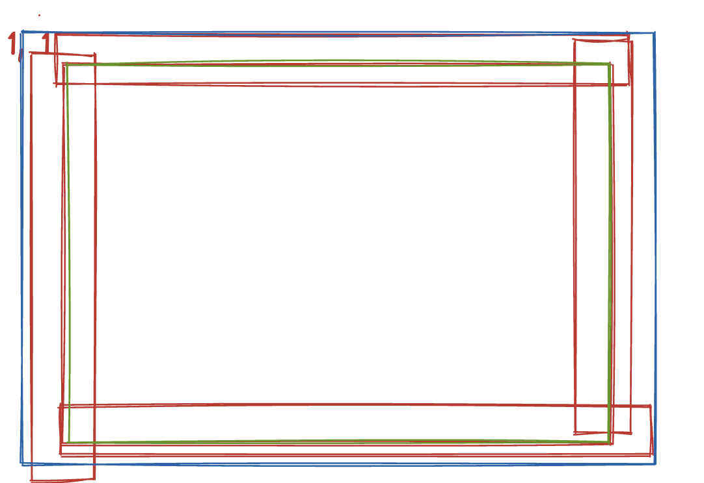

# 拼音编辑器

## 需求背景

实现一个拼音编辑器，提高教研同事工作效率

### 功能需求

1. 三种形式的内容编辑：
   - 组合格
   - 四线三格
   - 田字格
2. 组合格中的拼音支持切换音调，遵循拼音的注音逻辑
3. 多音字支持切换不同的拼音
4. 支持新增、删除、换行格子
5. 四线三格支持跟随内容的输入而宽度变化，自适应
6. 支持导出为 svg 形式的 base64
7. 支持修改编辑，编辑内容回显

## 技术实现

### DOM 结构

#### 主要元素

- **最外层`svg`**：编辑器内容区的容器，后面的子元素都是相对于这个 svg 进行定位的
- **`style`**：用来放置一些样式，根据是四线三格还是组合格，分别引入不同的字体文件
- **`defs`**：放置公共的 svg 图形组件
  - `sxsg-lines`：定义四线三格的线段
  - `tzg-lines`：定义田字格的线段
  - 使用方式：`<use href="#tzg-lines"></use>`

#### `svg.lattice`结构

- **背景线条**（红色区域）
- **内容编辑器区域**（蓝色区域）
  - `svg.frame-group`：组合格的内容区域
    - `svg.frame-sxsg`：四线三格的内容区域
    - `svg.frame-tzg`：田字格的内容区域边框
  - `use`：引用`defs`元素中声明好的图形
  - `foreignObject`：在 svg 元素中嵌入 html 内容

### 代码架构

#### 主要类

| 类名 | 职责 |
|------|------|
| `Editor` | 格子元素的增删改、换行控制，svg导出，编辑器初始化，数据回显 |
| `Lattice` | 创建格子元素结构，添加格子内的可编辑内容 |
| `EditText` | 处理编辑事件，输入内容校验，DOM事件处理 |
| `Frame` | 绘制格子线（四线三格和田字格的线段） |

> 注：`Events`类被`Lattice`和`EditText`继承，用于事件通信

## 核心功能实现

### 流程图

1. **拼音输入与声调切换**  
   

2. **汉字输入获取拼音**  
   [compositionend](https://developer.mozilla.org/en-US/docs/Web/API/Element/compositionend_event)  
   

3. **格子操作**  
   - 在`EditText`中触发事件
   - 传递至`Editor`进行格子元素控制

## 技术难点与解决方案

### 字体处理

#### 字体选择标准

- 汉字：楷体
- 英文：舒窈意大利斜体（与人教版pep保持一致）
- 拼音：需支持特殊字符（带音调字母）

#### 注意事项

1. 渲染问题：
   - 单层a vs 双层a（默认使用单层a）
2. 字体要求：
   - 必须支持特殊声调处理
   - 开源免费可商用
   - 中文字体需减小体积

#### 解决方案

- 选用字体：`OPPOSans-M-2`
- 工具：使用`fontmin`进行字体提取  
  [fontmin](https://github.com/ecomfe/fontmin)  
  http://ecomfe.github.io/fontmin/#app

### SVG技术实现

#### 绘制工具

使用[svgjs](https://svgjs.dev/docs/3.0/)进行SVG元素操作

#### 定位问题

- 默认定位：通过`x`,`y`属性相对于SVG原点定位
- 解决方案：创建多个`svg`元素作为独立坐标系

#### 画线实现

- 方法：在两个坐标点之间画线，进行均分边距

#### 矩形绘制

- 实现`box-sizing: 'border-box'`效果

### 样式与字体处理

1. 字体转换为`base64`格式
2. SVG样式需写在SVG作用域内

### 兼容性问题

#### Safari问题

**问题表现**：
- `foreignObject`样式失效
- `Kaiti`字体可能缺失

#### 解决方案（2023-05-12更新）

**技术方案**：`text-to-path`转换

1. 移除`style`内部的`fontface`引用，改为页面引入
2. 移除`foreignObject`，改用`path`元素
3. 选用较小中文字体：方正简体楷体（3.9MB）

**工具**：[text-to-path](https://github.com/shrhdk/text-to-svg)