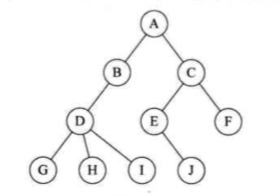
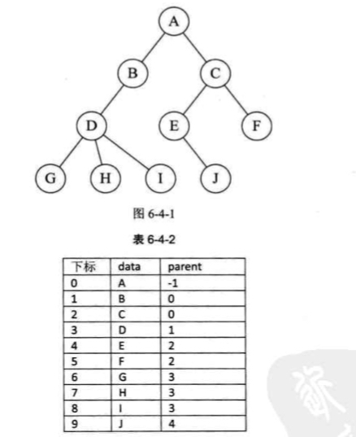
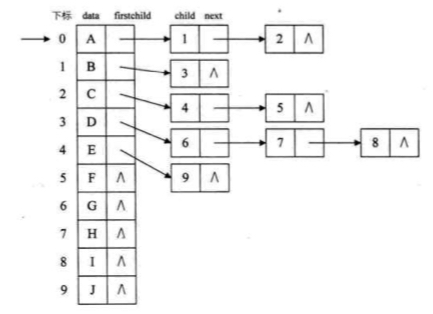
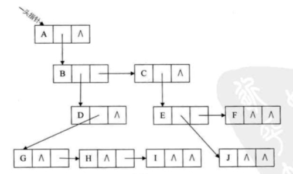
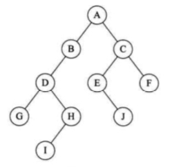
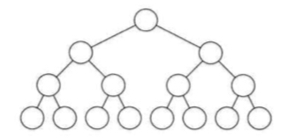
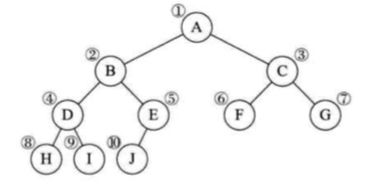
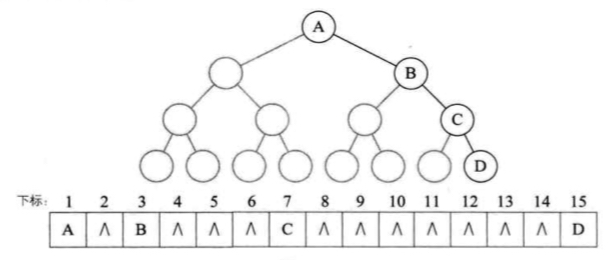
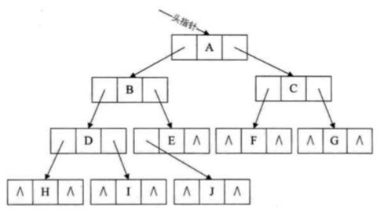

# 树

树是这样的一种结构：


对于树的定义如下：

> 树是 n (n >= 0) 个结点的有限集，n = 0 时称为空树，在任意一棵非空树中，
>
> 1. 有且仅用一个特定的称为 根（root）的节点
> 2. 当 n > 1 时，其余结点可分为 m（m > 0）个互不相交的有限集 T1, T2, ...Tn, 其中每一个集合本身也是一棵树， 并且称为 根的子树， 

对于树的存储方式， 可以使用三种表示法来存储树之间结点之间的相互关系：

双亲表示法， 孩子表示法， 孩子兄弟表示法

双亲表示法：

以一段连续的空间存储树的结点， 在每一个结点中，存储当前结点其双亲结点的存储位置：


data为数据域， 存储当前结点的相关数据， parent 为指针域， 存储当前节点的双亲结点在数组中的下标

比如下面的树使用双亲表示法表示：


根结点的双亲位置为 -1；

上面的表示法表示的树用于查找结点的双亲元素比较方便， 但是，如果这个结点下面包含有多个的子结点， 我们可以需要设置多个的指针域， 比如， 长子域， 右兄弟域等等。

孩子表示法：

孩子表示法的方式是：

将每个结点的孩子结点排列起来，以单链表作为存储结构，则 n 个结点有 n 个孩子链表，如果是叶子结点， 那么这个单链表为空，然后 n 个头指针又组成一个线性表，存放在一个一维数组中。

使用孩子表示法表示上面的树形结构：


在上面的孩子表示法中，设计有两种结构：

1. 孩子链表
   
   

   child 为数据域， 用来存储当前的子结点在表头数组中的下标， next 为指针域，存放的是下一个孩子的这个结构指针地址。

2. 表头结点
   
   

   表头结点存储每个结点， 用于树形结点的遍历使用，另外， 存储长子结点的指针域；

孩子兄弟表示法：

孩子兄弟表示法的数据结构如下：


data 为数据域

firstchild 为该结点第一个孩子结点的指针域

rightsib 为该结点的兄弟结点指针域

使用 孩子兄弟表示法组织后的数据结构如下：


上面的重新组织后的结构将一棵树转换为了一棵二叉树

## 二叉树

### 二叉树的定义

> 二叉树是 n 个结点的有限集合，该集合或者为空集（称为空二叉树），或者由一个根结点和两棵互不相交的，分别称为 根结点的左子树和右子树的二叉树组成 

二叉树的特点：

1. 每个结点最多有两棵子树
2. 左子树和右子树是有顺序的， 并且不能颠倒
3. 即使树中某结点只有一棵子树，也要区分顺序

如下图， 是一棵二叉树的示意图：


根据二叉树的结构显示， 可以将二叉树分为：满二叉树， 斜树 和 完全二叉树；

如下， 是满二叉树的图示：


树的每个结点都有左右两个结点， 故称为满二叉树。

### 二叉树的存储

#### 顺序存储

按照顺序存储二叉树， 主要是使用一维数组来顺序存储树中的各个结点，比如， 存储如下树结构：


使用顺序存储如下：


对于不存在的结点， 我们将不存在的结点设为 `^` 即可。

使用顺序存储存在的问题在于， 我们需要对于不存在的结点分配存储空间，比如，对于下面这个右斜树而言：


这样造成了存储空间的浪费。

#### 链式存储

对于二叉树结点的存储， 我们使用一种被称为 “二叉链表” 的链式存储结构来存储，

二叉链表是下面的这种结构：


这个结构中包含有一个数据域和两个指针域， 数据域表明当前结点的数据，指针域分别为二叉树左右两个结点的地址指针。

使用链式存储后的最终的存储链表结构如下：

